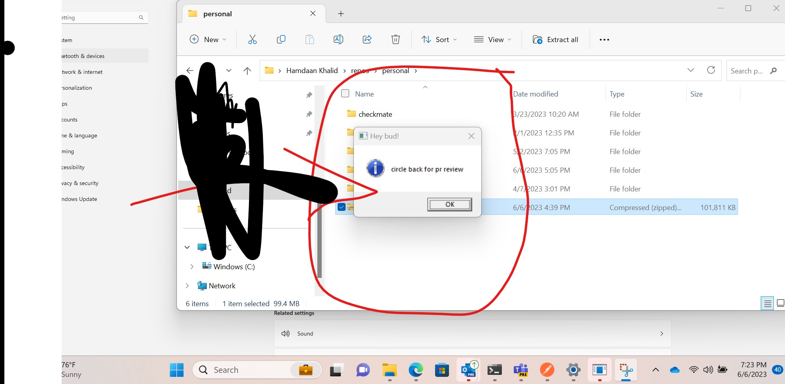

# Hey Bud!

I was waiting on a test pipeline to build and run, my boss messasged me something and I wanted to remind myself to do it after lunch, but I didn't want to exit my terminal...this happens surprisingly alot to me, maybe this happens to you too.

I wrote this little CLI called heybud that lets you create reminders that pop up as little windows in the duration you set the reminder for. I didn't want any transfer of data from my machine since work stuff is confidential, which is why i couldn't use a teams app or something. All of my data needs to stay right here :) 

Also good excuse to code something quick in rust.

## How to install
- Pull repo
- cargo build --release
- cargo install --path .

## How to use
Usage:
```
heybud '{insert your reminder}' {enter a number above 0 this will be the duration of mins before reminder shows up}
```

Example:
```
heybud 'whatever reminder you want' 2
```


